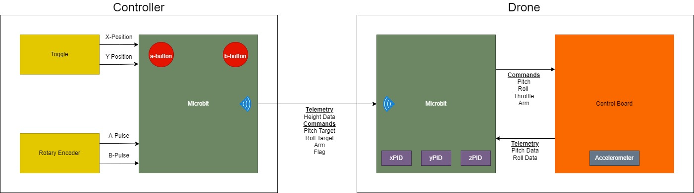
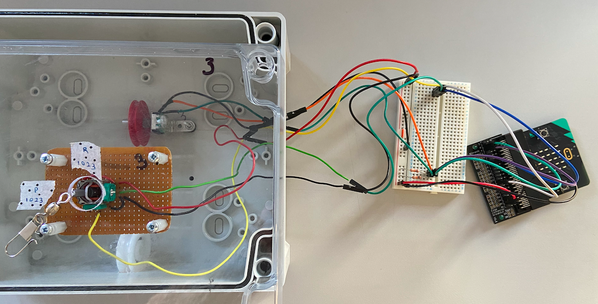
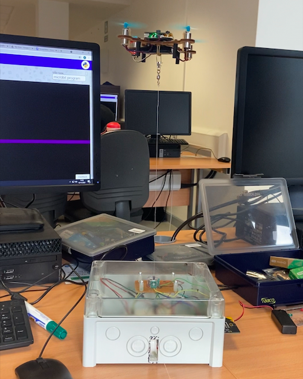

# Cyber-Physical-Systems
This repository contains code developed over a twelve week period to program a drone to
various specifications. We used the Air:bit drone, which can be programmed in Python using an on-board
micro-controller called a Micro:bit. Flying the drone requires the use of two Micro:bits - one acts
as a controller and the other is attached to the drone itself. Flying the drone involves writing
commands from the Micro:bit on the drone to an attached flight control board.

## Communication Between Drone and Controller:

## Wiring Setup for Tethered Drone

## Drone Flying While Tethered

## Links
### Documentation
- [Drone Notes](https://docs.google.com/document/d/1mzUDkRhHnkvjLE0Sy-6LmkqDHaynlPdhWon43XGht84/edit#)
- [Final Report](https://drive.google.com/file/d/1VnoNJvymu048e9ddwimH2TpME1mXMxNl/view?usp=sharing)
- [CPS Google Drive Folder](https://drive.google.com/drive/folders/1eACD1aFrtvmEcSMv1RTqgxcd4sY5XCYz?usp=sharing)

### Micropython
- [Editor](https://python.microbit.org/v/2)
- [Documentation](https://microbit-micropython.readthedocs.io/en/v1.0.1/)
- [Language and implementation](https://docs.micropython.org/en/latest/reference/index.html)

